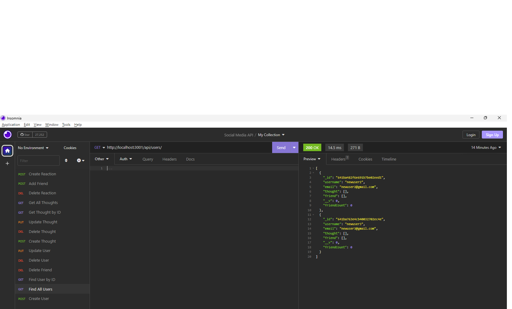

# Social-Media-API
A rest API for a social media website utilizing a noSQL database.

## Description

This application is a rest API that utilizes mongodb, mongoose, and express to store manipulate data for a social media website. The user of the application can access all the users, thoughts, and reactions stored in the database. As well as add, delete, and update users and thoughts. In addition to those features, the user can also add and remove reactions to/from thoughts and friends to/from users in the database.

## Walkthrough Video

## Screenshot

## Usage

To install the required dependencies, the user must run the command "npm i" in the terminal. To invoke the applicaiton the user must run the command "node server.js" in the terminal. Once the server is active, the routes can be accessed through the insomnia application which will display the routes and data associated for each. 

## Contributors

This application was created using resources such as peer study groups and tutoring sessions.

## Github

https://github.com/Dschnepf7/Social-Media-API

